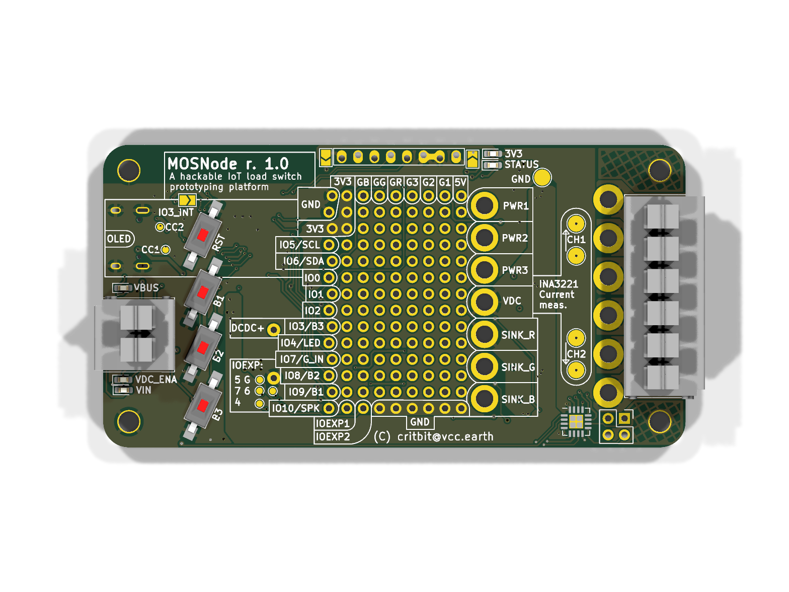
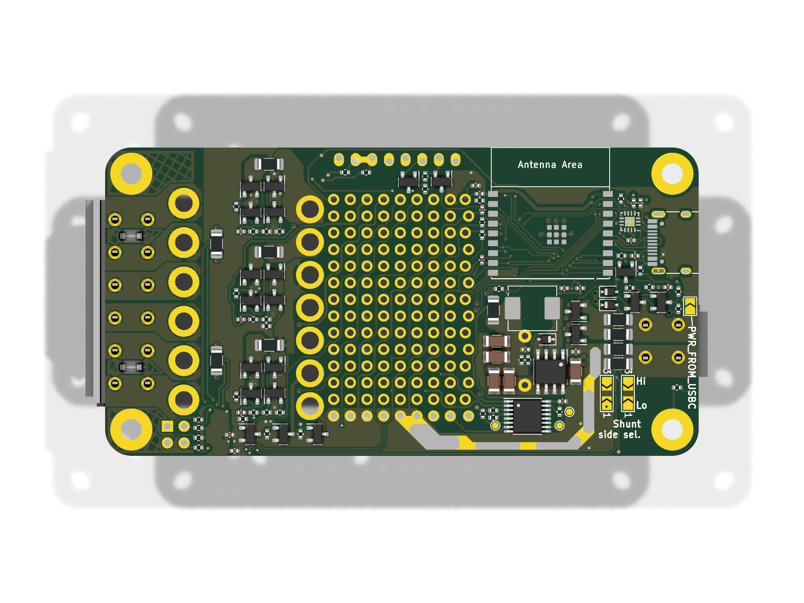

# MOSNode

### A hackable IoT load switch prototyping platform

This device was probably the peak of my overengineeringness - I decided to create the most universal board for controlling low voltage outputs (Like LED stripes, motors, etc.).

In the end, it was too annoying to setup the matrix connections, so I just abandoned it.

## License

Copyright 2023 Jakub "cr1tbit" Sadowski.

* **Hardware** (KiCad sources, production files and this documentation) is
  licensed under the [CERN-OHL-P v2](LICENSE) (permissive). You may
  redistribute and modify it and make products using it under the terms of
  that licence.
* **Firmware** in [MOSNode-fw/](outduino-fw/) is licensed under the
  [MIT License](outduino-fw/LICENSE).

This source is distributed WITHOUT ANY EXPRESS OR IMPLIED WARRANTY, INCLUDING
OF MERCHANTABILITY, SATISFACTORY QUALITY AND FITNESS FOR A PARTICULAR PURPOSE.
Please see the CERN-OHL-P v2 for applicable conditions.